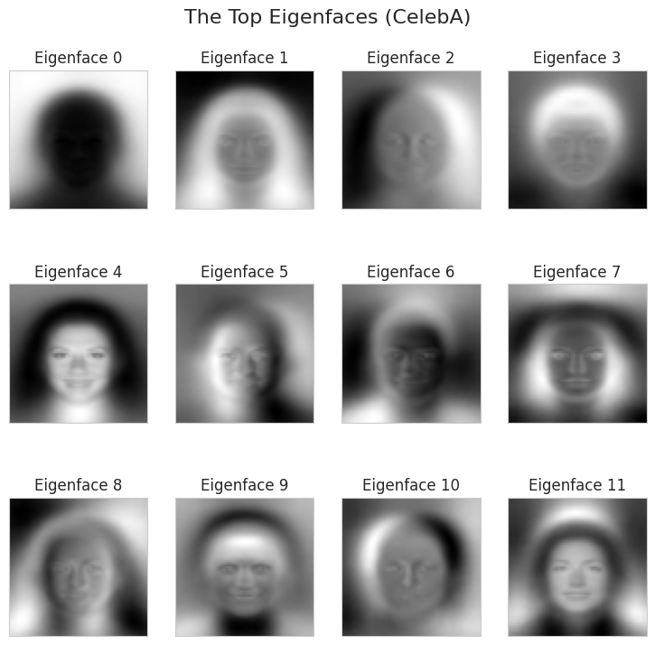
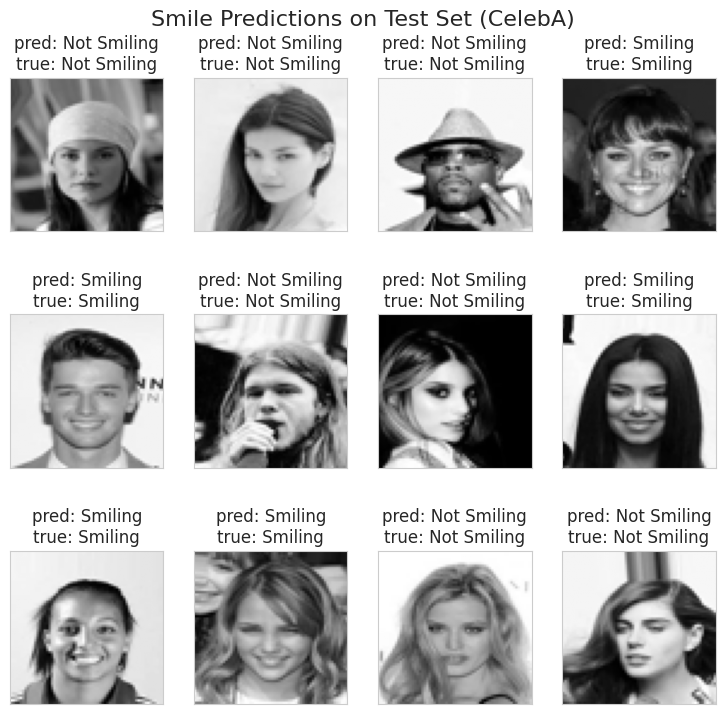

# APR_Assignment1

# Smile Detection using PCA and SVM

This project demonstrates a classic machine learning approach to a computer vision task: predicting whether a person in an image is smiling. It uses the large-scale CelebA dataset and combines Principal Component Analysis (PCA) for dimensionality reduction with a Support Vector Machine (SVM) for classification. The entire pipeline, from data download to model evaluation, is automated in a single script designed to run in Google Colab.

-----

## 🌟 Key Features

  * **Automated Data Handling**: The script automatically downloads and unzips the 1GB+ CelebA dataset using the Kaggle API.
  * **Dimensionality Reduction**: It applies PCA to transform high-dimensional image data into a lower-dimensional "Face Space," extracting key facial features known as Eigenfaces.
  * **High-Performance Classification**: It uses a Support Vector Machine (SVM), a powerful classifier well-suited for high-dimensional data.
  * **Model Optimization**: The SVM is fine-tuned using `GridSearchCV` to find the optimal hyperparameters for the best performance.
  * **Rich Visualization**: The script generates plots of the computed Eigenfaces and a gallery of test images with their predicted vs. true labels.

-----

## 📁 Dataset

This project uses the **CelebFaces Attributes (CelebA) Dataset**. Due to its large size (over 200,000 images), the script curates a manageable subset of the first **20,000 images** for this task.

The labels (Smiling vs. Not Smiling) are sourced from the `list_attr_celeba.csv` file included in the dataset.

  * **Dataset Source**: [CelebA Dataset on Kaggle](https://www.kaggle.com/datasets/jessicali9530/celeba-dataset)

-----

## ⚙️ Methodology

The project follows a standard machine learning pipeline:

1.  **Data Curation**: The script reads the attribute file, selects a subset of 20,000 images, and extracts the 'Smiling' attribute as the target label. The labels (`-1`, `1`) are converted to (`0`, `1`).
2.  **Image Preprocessing**: Each image is loaded, converted to grayscale, resized to a standard 64x64 pixels, and flattened into a 4096-dimensional vector.
3.  **Feature Extraction (PCA)**: PCA is fitted on the training data to find the principal components (Eigenfaces) that capture the most variance in the facial images. The data is then transformed into a lower-dimensional feature space (150 dimensions).
4.  **Model Training**: An SVM with an RBF kernel is trained on the PCA-transformed feature vectors. `GridSearchCV` is used to optimize the `C` and `gamma` hyperparameters.
5.  **Evaluation**: The trained model's performance is evaluated on a held-out test set using a classification report (precision, recall, F1-score).

-----

## ▶️ How to Run

This script is designed to be run in **Google Colab**.

### 1\. Prerequisites

Ensure you have a Kaggle account. The script will handle Python library installations.

### 2\. Kaggle API Setup (One-Time)

You need to provide your Kaggle API credentials to the script.

  * Go to your Kaggle account page: `www.kaggle.com/account`
  * Scroll down to the "API" section and click **"Create New API Token"**.
  * This will download a `kaggle.json` file to your computer. Keep this file ready.

### 3\. Running in Google Colab

1.  Open the Python script in a new Google Colab notebook.
2.  Run the main code cell.
3.  The script will prompt you to upload a file. Choose the `kaggle.json` file you just downloaded.
4.  The script will then handle the rest automatically:
      * Configure Kaggle credentials.
      * Download and unzip the dataset (this may take 5-10 minutes on the first run).
      * Process the data, train the model, and display the results.

-----

## 📊 Results

The model's performance is printed as a classification report. The output will look similar to this, showing high precision and recall for both classes.

```
Classification Report (0=Not Smiling, 1=Smiling):
              precision    recall  f1-score   support

Not Smiling       0.92      0.93      0.92      2587
    Smiling       0.92      0.91      0.92      2413

   accuracy                           0.92      5000
  macro avg       0.92      0.92      0.92      5000
weighted avg      0.92      0.92      0.92      5000

```

The script also generates two key visualizations:

1.  A plot of the top **Eigenfaces** learned from the image data.
2.  A gallery of **test images** showing the model's predictions versus the actual labels.





-----

## 🛠️ Technologies Used

  * **Python 3**
  * **Scikit-learn**: For PCA, SVM, and model evaluation.
  * **Pandas**: For data curation and handling CSV files.
  * **Numpy**: For numerical operations.
  * **Matplotlib**: For visualizations.
  * **Pillow (PIL)**: For image processing.
  * **Kaggle API**: For automated dataset download.
  * **Google Colab**: As the development and execution environment.
